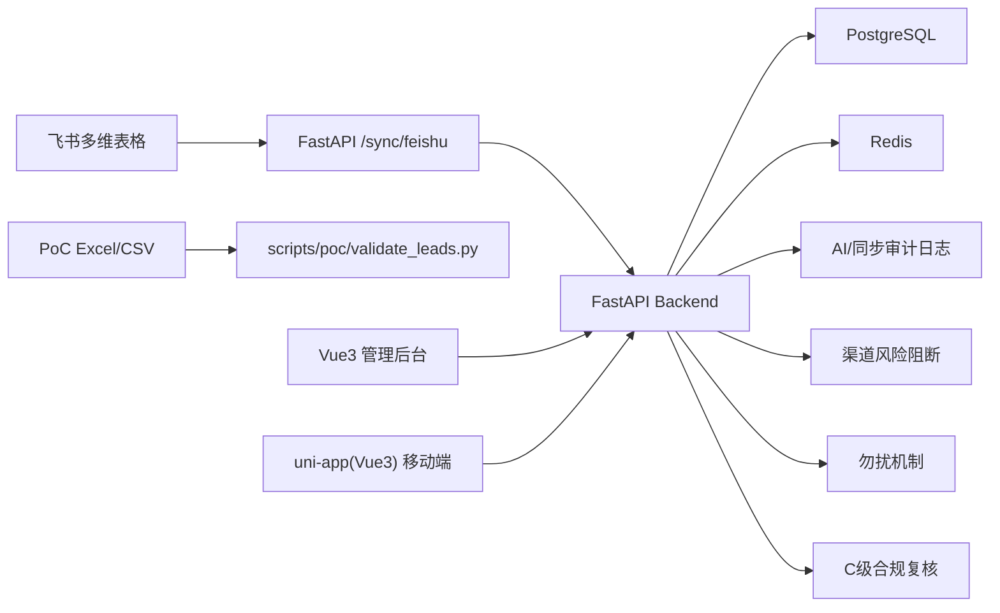

# 海外车辆采购 AI 获客系统部署手册

创建日期：2026-05-29  
适用阶段：PoC 已通过后的 MVP 试运行与后续生产化部署  
适用对象：研发、运维、线索运营、客服/销售负责人、合规/风控负责人  
关联文档：

- `docs/AI协同开发执行标准.md`
- `docs/crm/mvp-completion-audit.md`
- `docs/crm/mvp-qa-report.md`
- `docs/poc/poc-deploy-runbook.md`
- `docs/superpowers/plans/2026-05-26-海外车辆采购AI获客系统-总方案与Codex推进计划.md`
- `docs/product/2026-05-26-海外车辆采购AI获客系统-Sprint规划.md`
- `prototypes/mvp-mobile-agent/`

## 1. 部署目标

本手册用于把当前项目从本地开发和 PoC 产物推进到 MVP 试运行环境，并为后续生产部署预留标准路径。

部署后应具备：

- FastAPI 后端服务可运行，连接 PostgreSQL 与 Redis。
- Alembic 数据库迁移已执行到最新版本。
- 飞书同步、客户、渠道风险、触达、车源、合规复核、仪表盘等 API 可访问。
- uni-app(Vue3) 移动端可本地预览、测试，并可按目标端打包。
- Vue3 管理后台可本地预览、测试，并可构建静态文件。
- PoC Excel、prompts、CSV 校验脚本仍可复用。
- 全链路保留合规约束：不自动社交私信、不自动加好友、不登录后批量采集、不反爬规避。

## 2. 项目部署结构

```text
xagent/
  apps/
    api/                       FastAPI 后端服务
      app/
        api/                   API 路由
        db/                    SQLAlchemy Base 与 Session
        models/                PostgreSQL 数据模型
        schemas/               Pydantic API Schema
        services/              业务规则、同步、仪表盘、合规服务
        main.py                FastAPI 入口，含 /health
        settings.py            环境变量读取
      alembic/                 数据库迁移
      tests/                   后端测试
      .env                     本地/试运行环境变量，不得外泄
      pyproject.toml           Python 依赖声明
    mobile/                    uni-app(Vue3) 移动端
      src/pages/               首页、线索池、详情、触达、车源页面
      src/services/            前端规则与接口契约 view model
      tests/                   移动端核心规则测试
      package.json
    admin/                     Vue3 管理后台
      src/App.vue              后台总览、渠道、SLA、ROI、审计页面聚合
      src/services/            后台 API 契约与 view model
      tests/                   管理后台测试
      package.json
  docs/
    poc/                       PoC runbook、字段、风险、关键词、FAQ
    crm/                       MVP QA、完成性审计
    deploy/                    部署文档
    product/                   产品规划、Sprint、Epic/Story
    stories/                   BMAD Story 与 validation
    superpowers/               方案、计划与设计规格
  outputs/                     PoC Excel 与线索输出
  prompts/                     AI 抽取、分级 Prompt
  prototypes/mvp-mobile-agent/ 高保真原型
  scripts/
    poc/                       PoC 构建、校验脚本
    story-lock.js              Story 写锁脚本
```

## 3. 服务架构



## 4. 运行环境要求

### 4.1 基础软件

| 组件 | 建议版本 | 用途 |
|---|---|---|
| macOS / Linux | macOS 13+ 或主流 Linux | 本地开发、试运行、运维执行 |
| Python | 3.12+ | FastAPI、Alembic、测试脚本 |
| Conda | 已安装 | 推荐使用 `booking-room` 环境 |
| Node.js | v22.22.0 | 移动端、管理后台、脚本 |
| npm | Node 随附 | 安装与执行前端脚本 |
| PostgreSQL | 14+ | MVP 主数据库 |
| Redis | 6+ | 缓存、健康检查和后续任务队列基础 |

推荐本地 Shell 初始化：

```bash
source ~/.zshrc >/dev/null 2>&1 || true
conda activate booking-room
python --version
python -m pip --version
nvm use v22.22.0
```

API 项目要求 Python 3.12+。如果执行 `conda activate booking-room` 后 `python --version` 仍显示 Python 2.7 或其他错误版本，说明当前 shell 没有正确初始化 conda。可直接使用环境内解释器：

```bash
/opt/miniconda3/envs/booking-room/bin/python --version
/opt/miniconda3/envs/booking-room/bin/python -m pip --version
```

### 4.2 Python 依赖

当前 `apps/api/pyproject.toml` 声明了核心依赖：

- `fastapi`
- `uvicorn[standard]`
- `sqlalchemy`
- `alembic`
- `asyncpg`
- `psycopg[binary]`
- `pydantic-settings`
- `redis`
- `httpx`
- `pytest`
- `pytest-asyncio`

如果本机尚未安装依赖，建议在 `booking-room` 环境中安装：

```bash
cd apps/api
python -m pip install -e ".[test]"
```

如果当前 shell 没有正确激活 `booking-room`，使用绝对路径执行：

```bash
cd apps/api
/opt/miniconda3/envs/booking-room/bin/python -m pip install -e ".[test]"
```

### 4.3 Node 依赖

管理后台：

```bash
npm --prefix apps/admin install
```

移动端：

```bash
npm --prefix apps/mobile install
```

移动端使用 uni-app Vue3 版本线，`@dcloudio/uni-app` 和 `@dcloudio/vite-plugin-uni` 必须固定到同一个 `3.0.0-alpha-*` 版本；不要使用 `latest`。npm 当前的 `latest` 会解析到 Vue2 兼容包，并与 Vue3 产生 peer dependency 冲突。当前 uni-app 版本线内部使用 Vue `3.4.21`，项目根依赖也必须固定为 `3.4.21`，避免 H5 构建时混用不同 `@vue/*` 子包。

当前可安装基线：

| 包 | 版本 |
|---|---|
| `vue` | `3.4.21` |
| `@dcloudio/uni-app` | `3.0.0-alpha-5010120260525001` |
| `@dcloudio/uni-h5` | `3.0.0-alpha-5010120260525001` |
| `@dcloudio/vite-plugin-uni` | `3.0.0-alpha-5010120260525001` |
| `@dcloudio/types` | `3.4.31` |
| `vite` | `5.2.8` |

`@dcloudio/uni-h5` 必须作为 `apps/mobile/package.json` 的直接依赖声明，不能只依赖 `@dcloudio/uni-app` 的传递依赖。uni CLI 会根据当前包的直接依赖发现 H5 平台插件；缺少该声明时，`npm --prefix apps/mobile run dev:h5` 可能可以启动，但 H5 入口不会注入 `uni:h5-main-js`，浏览器表现为 `#app` 未挂载、页面空白。

如果网络受限，优先使用团队统一 npm registry 和锁定版本；不要在生产部署机临时混用未知源。

## 5. 环境变量配置

### 5.1 后端读取规则

后端通过 `apps/api/app/settings.py` 读取 `apps/api/.env`，当前真正使用的变量包括：

| 变量 | 必填 | 说明 |
|---|---|---|
| `DATABASE_URL` 或 `VEHICLE_LEADS_DATABASE_URL` | 是 | PostgreSQL 连接串，支持 `postgresql+asyncpg://...` |
| `REDIS_URL` 或 `VEHICLE_LEADS_REDIS_URL` | 试运行建议必填 | Redis 连接串 |
| `FEISHU_APP_ID` 或 `VEHICLE_LEADS_FEISHU_APP_ID` | 飞书同步时必填 | 飞书应用 ID |
| `FEISHU_APP_SECRET` 或 `VEHICLE_LEADS_FEISHU_APP_SECRET` | 飞书同步时必填 | 飞书应用密钥 |
| `FEISHU_BITABLE_APP_TOKEN` 或 `VEHICLE_LEADS_FEISHU_BITABLE_APP_TOKEN` | 飞书同步时必填 | 飞书多维表格 app token |

注意：

- 不要把真实 `.env`、数据库密码、飞书密钥、Redis 密码写入文档、代码或聊天记录。
- 当前 `apps/api/.env` 中存在一些历史业务变量，后端本项目当前只读取上表中的变量；其他变量可保留但不作为本系统 MVP 部署依赖。
- 试运行建议使用独立数据库、独立 Redis DB、独立飞书应用，避免污染其他项目环境。

### 5.2 `.env` 示例

```bash
DATABASE_URL=postgresql+asyncpg://vehicle_leads:<password>@<postgres-host>:5432/vehicle_leads
REDIS_URL=redis://:<password>@<redis-host>:6379/0
FEISHU_APP_ID=cli_xxx
FEISHU_APP_SECRET=<secret>
FEISHU_BITABLE_APP_TOKEN=<bitable_token>
```

## 6. 数据库部署

### 6.1 创建数据库和账号

在 PostgreSQL 中创建独立账号和数据库：

```sql
create user vehicle_leads with encrypted password '<password>';
create database vehicle_leads owner vehicle_leads;
grant all privileges on database vehicle_leads to vehicle_leads;
```

如使用云数据库，需同时配置：

- 白名单或安全组。
- SSL 策略。
- 自动备份。
- 慢查询和连接数监控。

### 6.2 执行 Alembic 迁移

在项目根目录执行：

```bash
source ~/.zshrc >/dev/null 2>&1 || true
conda activate booking-room
cd apps/api
alembic upgrade head
```

当前迁移链：

| 版本 | 说明 |
|---|---|
| `20260528_0001` | 初始数据底座 |
| `20260528_0002` | 触达记录状态扩展 |
| `20260528_0003` | 触达负责人字段 |
| `20260528_0004` | 车源字段扩展 |
| `20260528_0005` | 线索车源匹配 |
| `20260528_0006` | 合规复核扩展 |
| `20260528_0007` | ROI 成本记录 |
| `20260528_0008` | 渠道风险更新人 |

### 6.3 数据库验收

```bash
cd apps/api
alembic current
cd ../..
PYTHONPATH=apps/api pytest -q apps/api/tests/test_integration_postgres_redis.py
```

预期：

- Alembic 当前版本为最新 head。
- PostgreSQL 可查询到 MVP 数据表。
- Redis ping 成功。

## 7. 后端 API 部署

### 7.1 本地启动

```bash
source ~/.zshrc >/dev/null 2>&1 || true
conda activate booking-room
PYTHONPATH=apps/api uvicorn app.main:app --app-dir apps/api --host 0.0.0.0 --port 8000
```

健康检查：

```bash
curl http://127.0.0.1:8000/health
```

预期：

```json
{"status":"ok","service":"vehicle-leads-api"}
```

### 7.2 API 模块

| 模块 | 路由 | 用途 |
|---|---|---|
| 健康检查 | `GET /health` | 服务存活检查 |
| 客户/勿扰/触达 | `/customers/*` | 客户详情、勿扰、触达候选、触达记录 |
| 渠道风险 | `/channel-risks/*` | Low/Medium/High/Forbidden 规则与 AI 任务阻断 |
| 飞书同步/审计 | `/sync/*` | 飞书同步、同步与 AI 审计后台 |
| 合规复核 | `/compliance/*` | C 级合规复核、报价前阻断 |
| 车源/匹配 | `/inventory/*` | 车源、AI 报价安全、线索匹配 |
| 仪表盘 | `/dashboard/*` | 渠道、SLA、ROI、后台总览 |
| 触达草稿 | `/outreach-drafts/*` | 俄语草稿展示、人工确认记录 |

### 7.3 试运行部署方式

推荐使用进程管理器托管：

```bash
PYTHONPATH=/path/to/xagent/apps/api \
uvicorn app.main:app \
  --app-dir /path/to/xagent/apps/api \
  --host 0.0.0.0 \
  --port 8000 \
  --workers 2
```

生产建议：

- API 前置 Nginx 或云负载均衡。
- 开启 HTTPS。
- 限制管理后台访问来源。
- 日志输出到标准输出或统一日志系统。
- 将 `/health` 接入平台健康检查。

## 8. 管理后台部署

### 8.1 本地验证

```bash
nvm use v22.22.0
npm --prefix apps/admin install
npm --prefix apps/admin run test
npm --prefix apps/admin run check:syntax
```

当前项目已验证：

- `npm --prefix apps/admin run test`：`18 passed`
- `npm --prefix apps/admin run check:syntax`：通过

### 8.2 本地预览

使用管理后台自带脚本启动：

```bash
npm --prefix apps/admin run dev
```

访问：

```text
http://127.0.0.1:5174
```

注意：不要使用 `npm --prefix apps/admin exec vite -- --host 0.0.0.0 --port 5174` 作为常规启动方式。该命令可能以仓库根目录作为 Vite root，导致访问 `/` 返回 404，只能在 `/apps/admin/` 看到页面。

### 8.3 构建静态文件

```bash
npm --prefix apps/admin run build
```

构建产物通常输出到：

```text
apps/admin/dist/
```

部署方式：

- 将 `apps/admin/dist/` 放到 Nginx、OSS 静态站点、Vercel、Netlify 或公司前端托管平台。
- 后台接口地址应通过运行时配置或构建环境变量指向 API 网关。
- 当前后台服务层支持传入 `baseUrl`，正式联调时需要把 seed 数据切换为真实 API 调用。

### 8.4 管理后台验收重点

- 后台总览展示候选线索、B/C 级、回复率、SLA 风险。
- 渠道仪表盘展示采集数、B/C 数、无效率、风险状态。
- SLA 仪表盘展示 B 级 48 小时、C 级 24 小时。
- 风险配置可维护允许动作、禁止动作、政策来源、更新人。
- 同步与 AI 审计展示同步日志、AI 任务、模型、状态、风险、来源和阻断原因。
- ROI 指标不得作为绕过合规限制的理由。

## 9. 移动端部署

### 9.1 本地验证

```bash
nvm use v22.22.0
npm --prefix apps/mobile install
npm --prefix apps/mobile run test
```

当前项目已验证：

- `npm --prefix apps/mobile run test`：`39 passed`

### 9.2 H5 本地预览

使用移动端自带 uni-app H5 脚本启动：

```bash
npm --prefix apps/mobile run dev:h5
```

H5 构建：

```bash
npm --prefix apps/mobile run build:h5
```

移动端 H5 默认会访问 `http://localhost:8000` 的 FastAPI 服务。正式或联调环境可通过构建环境变量覆盖：

```bash
VITE_API_BASE_URL=https://api.example.com npm --prefix apps/mobile run build:h5
```

当前移动端已接入以下后端接口，并在接口不可用时保留本地 seed 数据降级展示，避免白屏：

- `GET /dashboard/admin-overview`：首页指标、队列和渠道表现。
- `GET /customers/outreach-candidates`：线索池列表。
- `GET /customers/{customer_id}`：线索详情基础信息。
- `POST /customers/{customer_id}/do-not-contact`：移动端人工标记勿扰。
- `GET /customers/{customer_id}/outreach-records`：线索触达历史。
- `GET /inventory/items`：车源匹配页列表。
- `GET /outreach-drafts/{customer_id}`：AI 俄语触达草稿。
- `POST /outreach-drafts/{customer_id}/record-manual-send`：记录人工发送。

FastAPI 已默认允许 `http://localhost:5176`、`http://127.0.0.1:5176`、`http://localhost:5174`、`http://127.0.0.1:5174` 跨域访问。其他域名需设置 `CORS_ORIGINS` 或 `VEHICLE_LEADS_CORS_ORIGINS`，多个 origin 用英文逗号分隔。

如果访问 `http://localhost:5176/` 仍然一片空白，优先检查：

- `apps/mobile/package.json` 是否直接声明 `@dcloudio/uni-h5`，版本需与 `@dcloudio/uni-app`、`@dcloudio/vite-plugin-uni` 保持一致。
- `apps/mobile/index.html` 的入口是否为 `/src/main.js`。
- `npm --prefix apps/mobile run build:h5` 后，`apps/mobile/dist/build/h5/assets/index-*.js` 中是否包含 `mount("#app")`，并生成了 `pages-home-index.*.js` 首页 chunk。

本地预览 H5 构建产物：

```bash
npm --prefix apps/mobile run preview:h5
```

### 9.3 小程序或 App 打包

当前仓库主要完成移动端 MVP 工作台页面与规则测试，正式小程序/App 打包前建议补齐：

- `apps/mobile/package.json` 中的 uni-app 标准脚本。
- 目标端 manifest 配置。
- API base URL 环境配置。
- 登录鉴权与角色权限。
- 真机截图和移动端视觉 QA。

目标端部署流程：

1. 配置 `manifest.json` 的 AppID、小程序信息和权限说明。
2. 配置 API 网关域名白名单。
3. 执行目标端构建。
4. 使用 HBuilderX 或 CI 上传小程序包。
5. 在体验版验证首页、线索池、详情、触达助手、车源匹配。
6. 通过后再提交审核或分发试运行版本。

### 9.4 移动端验收重点

- 首页展示今日任务、AI 状态、关键指标、渠道摘要。
- 线索池支持待处理、B 级、C 级、超时、勿扰筛选。
- 线索详情显示来源证据、AI 推荐理由、风险提示、触达历史、车源入口。
- 勿扰客户不能生成触达草稿。
- High/Forbidden 渠道不能进入触达动作。
- C 级线索显示合规复核状态，报价前阻断生效。
- 人工确认后才可记录已发送。

## 10. PoC 工具部署与运行

PoC 阶段仍作为试运行运营工具保留。

一键构建和检查：

```bash
chmod +x scripts/poc/run_poc.sh
scripts/poc/run_poc.sh all
```

只生成 Excel：

```bash
scripts/poc/run_poc.sh build
```

校验飞书导出的客户线索 CSV：

```bash
scripts/poc/run_poc.sh validate path/to/客户线索.csv outputs/poc-validation/lead-validation-report.json
```

关键输出：

- `outputs/poc-feishu-seed/俄罗斯车辆采购AI获客PoC-飞书五张表Seed数据.xlsx`
- `outputs/poc-feishu-seed/客户线索.xlsx`
- `outputs/poc-feishu-seed/渠道来源.xlsx`
- `outputs/poc-feishu-seed/车源报价.xlsx`
- `outputs/poc-feishu-seed/触达记录.xlsx`
- `outputs/poc-feishu-seed/话术库.xlsx`
- `outputs/poc-keywords/俄罗斯车商线索关键词库初版.xlsx`
- `outputs/poc-faq/FAQ与俄语触达模板初版.xlsx`

详细 PoC runbook 见：

- `docs/poc/poc-deploy-runbook.md`

## 11. 飞书同步配置

### 11.1 飞书侧准备

1. 创建飞书应用。
2. 开启多维表格读取权限。
3. 创建或确认 PoC 五张表：
   - 客户线索表
   - 渠道来源表
   - 车源/报价表
   - 触达记录表
   - 话术库表
4. 按 `docs/poc/feishu-fields.md` 配置字段。
5. 保存 `FEISHU_APP_ID`、`FEISHU_APP_SECRET`、`FEISHU_BITABLE_APP_TOKEN`。

### 11.2 后端同步

写入 `.env` 后启动 API，执行：

```bash
curl -X POST "http://127.0.0.1:8000/sync/feishu?dry_run=true"
```

干跑确认无误后：

```bash
curl -X POST "http://127.0.0.1:8000/sync/feishu"
```

同步结果可通过：

```bash
curl "http://127.0.0.1:8000/sync/audit-dashboard"
```

### 11.3 同步原则

- MVP 为飞书到 PostgreSQL 单向同步。
- 不从系统反写飞书，避免数据覆盖和权限风险。
- 同步失败必须记录 `SyncLog`。
- AI 审计和阻断原因必须保留。
- 勿扰状态同步后不得丢失标记人、标记时间和原因。

## 12. 完整部署顺序

### Step 1：拉取/准备代码

```bash
cd /path/to/xagent
```

当前用户已要求暂不依赖 git 操作，因此本手册不写 `git pull`、`commit`、`push` 作为必须步骤。

### Step 2：准备运行环境

```bash
source ~/.zshrc >/dev/null 2>&1 || true
conda activate booking-room
nvm use v22.22.0
```

### Step 3：安装依赖

```bash
cd apps/api
python -m pip install -e ".[test]"
python -m pip install asyncpg redis httpx pytest-asyncio
cd ../..
npm --prefix apps/admin install
npm --prefix apps/mobile install
```

### Step 4：配置环境变量

编辑：

```text
apps/api/.env
```

至少配置：

```bash
DATABASE_URL=<postgresql+asyncpg connection url>
REDIS_URL=<redis connection url>
FEISHU_APP_ID=<feishu app id>
FEISHU_APP_SECRET=<feishu app secret>
FEISHU_BITABLE_APP_TOKEN=<feishu bitable app token>
```

### Step 5：执行数据库迁移

```bash
cd apps/api
alembic upgrade head
cd ../..
```

### Step 6：运行验证

```bash
PYTHONPATH=apps/api pytest -q apps/api/tests
python -m compileall apps/api/app
npm --prefix apps/admin run test
npm --prefix apps/admin run check:syntax
npm --prefix apps/mobile run test
PYTHONPATH=. pytest -q tests/scripts/poc/test_validate_leads.py
```

当前已通过基线：

- API：`63 passed, 280 warnings`
- Admin：`18 passed`
- Mobile：`28 passed`
- PoC CSV：`6 passed`

### Step 7：启动 API

```bash
PYTHONPATH=apps/api uvicorn app.main:app --app-dir apps/api --host 0.0.0.0 --port 8000
```

验证：

```bash
curl http://127.0.0.1:8000/health
```

### Step 8：启动管理后台

```bash
npm --prefix apps/admin exec vite -- --host 0.0.0.0 --port 5174
```

访问：

```text
http://127.0.0.1:5174
```

### Step 9：启动移动端 H5 预览

```bash
npm --prefix apps/mobile run dev:h5
```

访问：

```text
http://127.0.0.1:5175
```

### Step 10：执行飞书同步干跑

```bash
curl -X POST "http://127.0.0.1:8000/sync/feishu?dry_run=true"
```

确认字段映射和数量无误后再执行正式同步。

## 13. 试运行操作流程

### 13.1 每日启动检查

1. API `/health` 返回 OK。
2. PostgreSQL 可连接。
3. Redis ping 成功。
4. `/sync/audit-dashboard` 可返回最近同步状态。
5. 管理后台可打开。
6. 移动端首页可打开。
7. High/Forbidden 阻断规则未被改为允许。

### 13.2 每日运营流程

1. 线索运营在飞书维护 Low/Medium 公开渠道线索。
2. 执行飞书同步或 CSV 校验。
3. AI 辅助抽取、去重、分级和标签。
4. 人工复核 A/B/C/Invalid/Watch。
5. Invalid/Watch 不进入触达队列。
6. B 级交付客服。
7. C 级交付出口销售，但报价/合同前必须合规复核。
8. 客服/销售只做人工触达，并登记触达结果。
9. 拒绝联系客户标记勿扰。
10. 管理者查看渠道、SLA、ROI 和审计。

### 13.3 每日收口

1. 查看 B/C 级数量和无效率。
2. 查看 48 小时 B 级 SLA、24 小时 C 级 SLA。
3. 查看拒绝、投诉、封禁或违规风险。
4. 查看同步失败和 AI 审计失败。
5. 输出当日问题清单。

## 14. 合规与安全门禁

部署和试运行期间必须持续满足：

- 不自动社交私信。
- 不自动加好友。
- 不登录后批量采集。
- 不反爬规避。
- 不采集非公开数据。
- 不绕过平台政策。
- High 风险渠道只做政策研究和人工小样本，不进入自动任务。
- Forbidden 渠道不得进入自动任务。
- AI 缺失字段输出 `Unknown`、`null` 或空数组，不编造。
- AI 输出必须保留来源证据、输入、输出、模型、prompt 版本、时间和执行状态。
- 勿扰客户不得再次进入触达队列。
- C 级线索报价/合同前必须合规复核。
- ROI 指标不得作为绕过合规限制的理由。

## 15. 监控与日志

### 15.1 API 监控

建议监控：

- `/health` 状态。
- API 5xx 数量。
- API P95 延迟。
- PostgreSQL 连接数。
- Redis 连接状态。
- Alembic 当前版本。

### 15.2 业务监控

建议每日查看：

- 候选线索数。
- B/C 级线索数。
- Invalid/Watch 比例。
- 渠道无效率。
- B 级 48 小时 SLA 风险。
- C 级 24 小时 SLA 风险。
- 触达回复率。
- 勿扰新增数。
- C 级合规待复核数。
- 同步失败数。
- AI 任务失败数。
- High/Forbidden 阻断次数。

### 15.3 日志保留

建议保留：

- API access log：至少 30 天。
- 应用 error log：至少 90 天。
- SyncLog / AIAuditLog：至少 180 天。
- 合规复核记录：按业务合规要求长期保留。

## 16. 备份与恢复

### 16.1 PostgreSQL 备份

试运行建议每日备份：

```bash
pg_dump "$DATABASE_URL" > backups/vehicle_leads_$(date +%Y%m%d_%H%M%S).sql
```

云数据库建议开启：

- 每日自动快照。
- 至少 7-30 天保留。
- 恢复演练。

### 16.2 Excel 与飞书备份

- PoC seed 文件保留在 `outputs/`。
- 飞书表格建议每日导出 CSV 或 Excel。
- 重要触达记录、勿扰状态、合规复核记录不得只存在本地文件。

## 17. 回滚方案

### 17.1 API 回滚

如果新版本 API 出现 P0/P1 问题：

1. 停止新进程。
2. 启动上一版本代码目录或上一镜像。
3. 保持数据库只读检查，确认是否有新迁移影响。
4. 如果新迁移不可逆，不直接降级数据库，先由研发判断补丁或数据修复方案。

### 17.2 数据库回滚

原则：

- 生产环境禁止直接 `DROP TABLE`、`TRUNCATE`、破坏性回滚。
- Alembic downgrade 只在确认迁移可逆且已有备份后执行。
- 涉及客户、触达、勿扰、合规记录的数据修复必须先导出备份。

### 17.3 前端回滚

管理后台和 H5：

1. 保留上一版 `dist/`。
2. 新版异常时切回上一版静态目录。
3. 清理 CDN 缓存。
4. 重新执行关键页面验收。

移动端小程序/App：

- 小程序优先回退体验版或线上版本。
- App 通过灰度、热更新或重新发版处理。

## 18. 常见问题

### 18.1 API 测试连接 PostgreSQL/Redis 失败

现象：

- `PermissionError: Operation not permitted`
- `Error connecting to <host>:5432`
- `Error connecting to <host>:6379`

处理：

1. 确认当前环境允许外网或内网访问数据库。
2. 确认安全组/白名单包含当前机器 IP。
3. 确认 `.env` 连接串正确。
4. 确认 PostgreSQL/Redis 服务运行。
5. 在受限沙箱中需要使用允许网络访问的执行环境。

### 18.2 Alembic 找不到配置

处理：

```bash
cd apps/api
alembic upgrade head
```

不要在错误目录直接执行。

### 18.3 前端没有 dev/build 脚本

管理后台请使用包内脚本，避免 Vite root 指向仓库根目录：

```bash
npm --prefix apps/admin run dev
npm --prefix apps/admin run build
npm --prefix apps/mobile run dev:h5
npm --prefix apps/mobile run build:h5
```

移动端 H5 开发和构建脚本已补齐；小程序/App 目标端仍需在正式发布前补对应平台脚本和真机验收。

### 18.4 管理后台仍显示 seed 数据

这是当前 MVP P2 残留风险。API 契约和测试已存在，试运行前建议安排后台真实接口联调：

- `/dashboard/admin-overview`
- `/dashboard/channel-leads`
- `/dashboard/outreach-sla`
- `/dashboard/roi-metrics`
- `/channel-risks`
- `/sync/audit-dashboard`

## 19. 发布验收清单

上线或试运行前逐项确认：

- [ ] `.env` 已配置真实 PostgreSQL、Redis、飞书变量。
- [ ] 密钥未写入文档、代码或日志。
- [ ] `alembic upgrade head` 已执行。
- [ ] `/health` 返回 OK。
- [ ] API 全量测试通过。
- [ ] Admin 测试和语法检查通过。
- [ ] Mobile 测试通过。
- [ ] PoC CSV 脚本测试通过。
- [ ] 飞书同步 dry run 通过。
- [ ] High/Forbidden 阻断规则可见且生效。
- [ ] 勿扰客户不会进入触达队列。
- [ ] C 级合规复核阻断报价/合同动作。
- [ ] 管理后台可查看同步、AI 审计和阻断原因。
- [ ] 已准备备份与回滚方案。
- [ ] 运营、客服、销售、合规已确认试运行 SOP。

## 20. 后续生产化建议

当前 MVP 已允许试运行。进入正式生产前建议补齐：

1. 后端 Dockerfile、前端 Dockerfile 或静态部署 CI。
2. `.env.example` 与密钥管理规范。
3. Admin 和 Mobile 的固定 `dev`、`build`、`preview` scripts。
4. API 鉴权、角色权限和管理后台登录。
5. HTTPS、CORS、访问白名单和审计日志脱敏。
6. 定时任务队列，用于飞书同步和 AI 审计任务。
7. 管理后台真实 API 联调，替换首屏 seed 数据。
8. 移动端真机 QA、截图验收和小程序/App 打包流程。
9. `datetime.utcnow()` 技术债治理。
10. 生产监控、告警、备份恢复演练。
