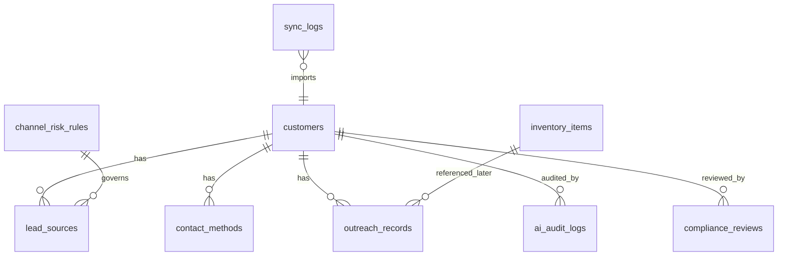

# MVP 数据底座数据字典

创建日期：2026-05-28  
对应 Story：E1-S1 定义客户主体模型  
适用阶段：Sprint 3 MVP 数据底座

## ERD 概览

## 核心表

| 表名 | 说明 | 关键字段 |
|---|---|---|
| `customers` | 客户主体，一家车商/客户一条主记录 | name、country、city、customer_type、grade、status、owner、do_not_contact |
| `lead_sources` | 来源记录，一个客户可挂多个来源 | customer_id、platform、source_url、evidence_note、channel_risk_level |
| `contact_methods` | 联系方式，一个客户可挂多个联系方式 | customer_id、method_type、value、source_url、evidence_note |
| `outreach_records` | 触达记录 | customer_id、channel、status、script_version、sent_by、next_action、triggers_do_not_contact |
| `inventory_items` | 轻量车源/报价 | brand、model、year、mileage_km、quoted_price、quote_status、export_ready |
| `channel_risk_rules` | 渠道风险配置 | channel_name、risk_level、collection_allowed、ai_processing_allowed、allowed_actions、forbidden_actions |
| `ai_audit_logs` | AI 输入输出审计 | customer_id、task_type、model_name、prompt_version、source_url、input_payload、output_payload、risk_blocked |
| `compliance_reviews` | 合规复核 | customer_id、review_type、status、reason、reviewer、reviewed_at |
| `sync_logs` | 飞书等外部数据同步日志 | source_name、object_name、status、success_count、failure_count、error_summary |

## E1-S1 验收映射

| 验收项 | 实现位置 |
|---|---|
| 客户主体包含名称、国家、城市、客户类型、等级、状态、负责人、勿扰状态 | `apps/api/app/models/customer.py` |
| 来源记录可一对多挂到客户主体 | `Customer.sources` + `LeadSource.customer_id` |
| 联系方式可一对多挂到客户主体 | `Customer.contact_methods` + `ContactMethod.customer_id` |
| 一个客户可以同时拥有官网、Telegram、VK、邮箱、电话等多个来源或联系方式 | `ContactMethodType` 枚举支持 email、phone、website、website_form、telegram、vkontakte、whatsapp 等 |
| 来源证据和 AI 审计不可被合并流程覆盖 | `lead_sources.evidence_note` 与 `ai_audit_logs.input_payload/output_payload` 独立保存 |

